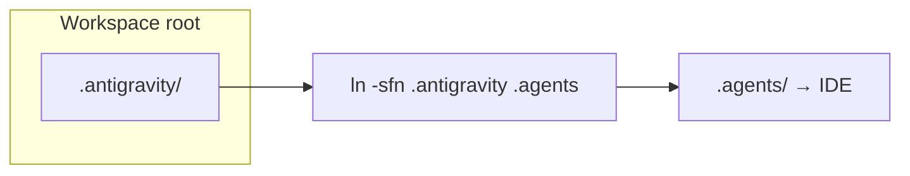
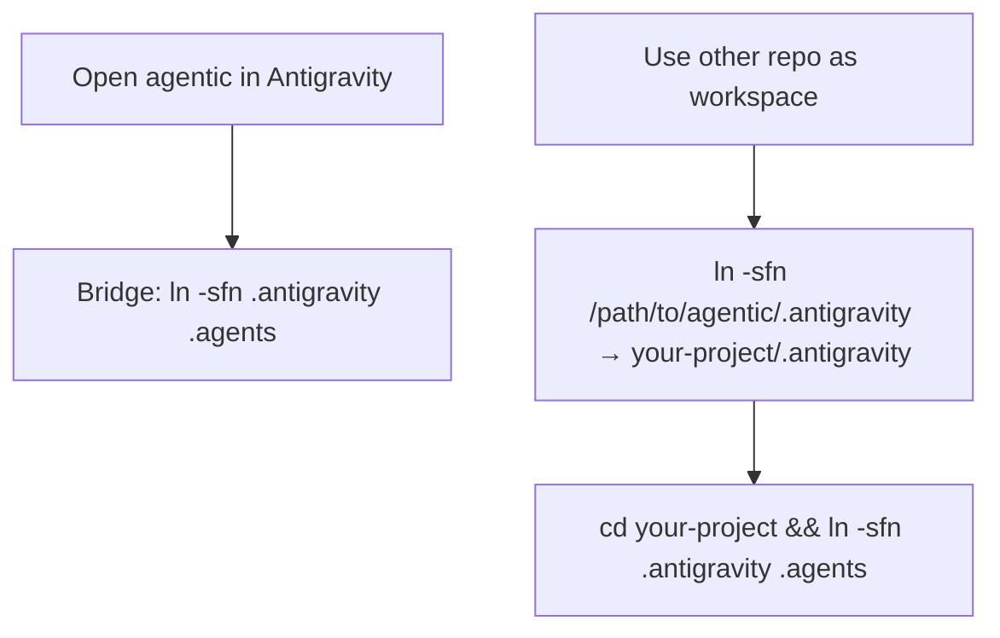
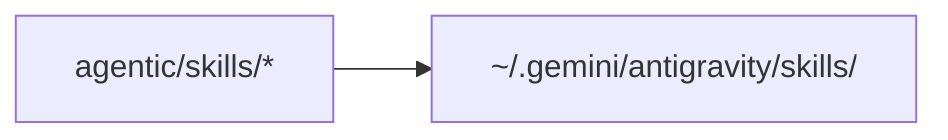

# Antigravity (Google) — workspace bundle

Canonical copy lives under **`.antigravity/`** so it does not compete with other tools that reserve **`.agents/`** for their own config.

**Open Code** uses a parallel bundle at [**`../.opencode/`**](../.opencode/README.md) (Oh My OpenAgent + plugins); root **`opencode.json`** holds providers and npm plugins.

## How Antigravity finds it

Google’s codelab expects workspace paths like **`.agents/rules/`**, **`.agents/workflows/`**, **`.agents/skills/`**. This repo keeps real files under **`.antigravity/`** and you bridge with a **local symlink** (listed in `.gitignore` so it is not committed):

**Command** (from the folder you open in Antigravity): `ln -sfn .antigravity .agents`

Then open or reload the workspace. Remove `.agents` when you do not need Antigravity.

If a build only looks for `.agent/` (singular): `ln -sfn .antigravity .agent`

References: [Rules & workflows](https://codelabs.developers.google.com/getting-started-google-antigravity) (§8–9), [Authoring skills](https://codelabs.developers.google.com/getting-started-with-antigravity-skills).

## Layout (inside `.antigravity/`)

| Path | Purpose |
|------|---------|
| `rules/` | Always-on guidance. |
| `workflows/` | Saved prompts; invoke with `/` in Antigravity. |
| `skills/` | Symlinks → `../skills/` (single source of truth at repo root). |

## This repo vs another project

**Other project** (adjust paths): `ln -sfn /path/to/agentic/.antigravity /path/to/your-project/.antigravity` then `cd /path/to/your-project && ln -sfn .antigravity .agents`

## Global skills

Optional — reuse the same skill folders in **every** Antigravity project (`~/.gemini/antigravity/skills/`):

**Commands:** `AGY_GLOBAL="$HOME/.gemini/antigravity/skills"` · `mkdir -p "$AGY_GLOBAL"` · then for each `agentic/skills/<name>` run `ln -sfn /path/to/agentic/skills/<name> "$AGY_GLOBAL/<name>"` (or a small loop over `skills/*/`).

Each entry in `.antigravity/skills/<name>` points at `../../skills/<name>`. On Windows, use `mklink /J` or enable git symlinks.
