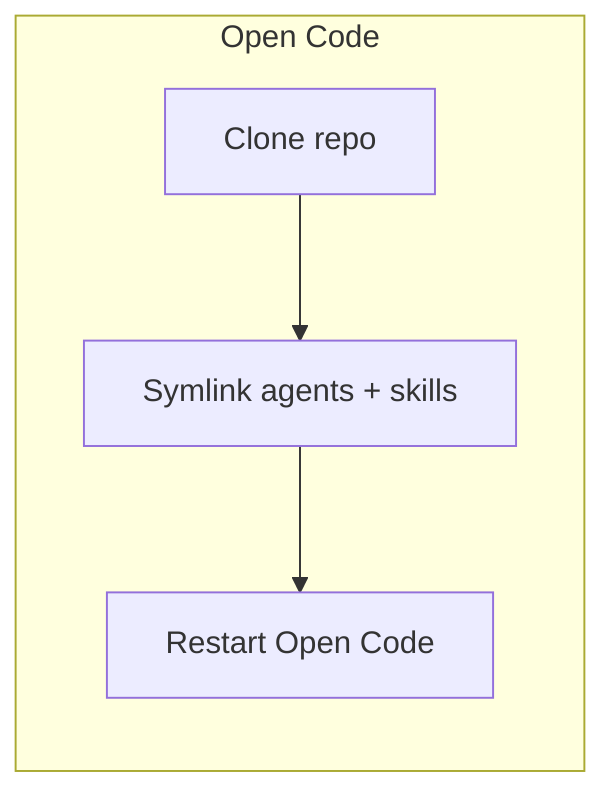
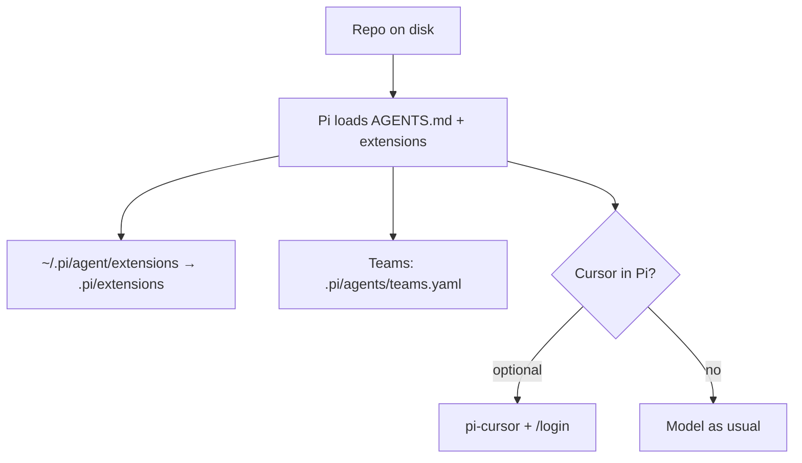
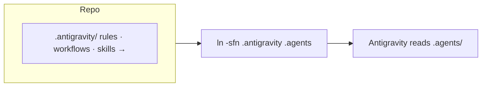
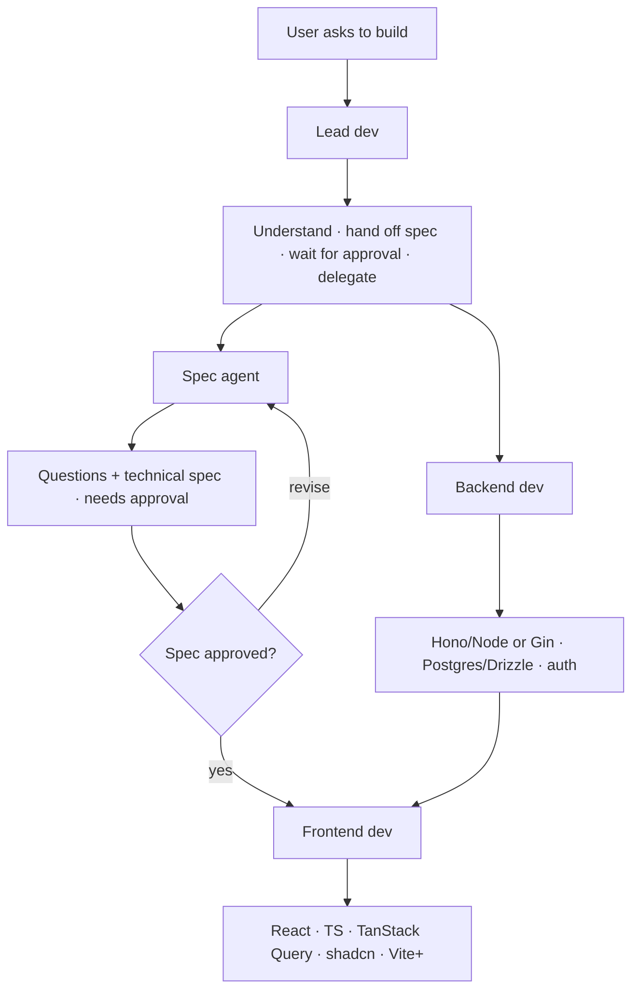

# Isa Agentic Workflow

A comprehensive collection of specialized AI agents designed to accelerate and enhance every aspect of rapid development. Each agent represents my current knowledge and will be improved later.

## 📥 Installation

1. Clone: `git clone https://github.com/faris-isa/agentic.git`
2. Point Open Code at this copy (adjust paths if your clone lives elsewhere):
   - `ln -s ~/app/isa/agentic/agents ~/.config/opencode/agents`
   - `ln -s ~/app/isa/agentic/skills ~/.config/opencode/skills`
3. Restart **Open Code**.

### Pi (pi-coding-agent)

Pi discovers extensions from `~/.pi/agent/extensions` and `<repo>/.pi/extensions`. Team presets live in `.pi/agents/teams.yaml`.

**Requirements:** Node.js 22+ and Pi **v0.71+** ([extensions migration](https://github.com/earendil-works/pi-mono/blob/main/packages/coding-agent/CHANGELOG.md#extensions-migration), [extensions docs](https://github.com/earendil-works/pi-mono/blob/main/packages/coding-agent/docs/extensions.md)).

**Optional — Cursor models in Pi:** `pi install npm:@schultzp2020/pi-cursor`, then `/login` → **Cursor** → `/model`.

**Symlink this repo into Pi** (adjust the left-hand paths if needed): `mkdir -p ~/.pi/agent`; then `ln -sf ~/app/isa/agentic/.pi/agents ~/.pi/agents`, `ln -sf ~/app/isa/agentic/.pi/extensions ~/.pi/agent/extensions`, `ln -sf ~/app/isa/agentic/skills ~/.pi/agent/skills`. Restart Pi after changes. The `agent-team` stub under `.pi/extensions/agent-team/` keeps the extension scanner happy when this folder is linked.

### Google Antigravity

Bundle: **`.antigravity/`** — see [`.antigravity/README.md`](.antigravity/README.md). Create the symlink at the workspace root when using Antigravity: `ln -sfn .antigravity .agents` (ignored by git in this repo).

## 🏗️ Workflow

In Open Code / Cursor, backend work and spec refinement can overlap in practice; the important gate is **explicit approval** before large implementation.

## 👥 Team

| Agent | Type | Role |
|-------|------|------|
| **lead-dev** | primary | Orchestrates workflow, coordinates team |
| **spec-agent** | subagent | Designs Technical Specifications, gets approval |
| **frontend-dev** | subagent | Implements frontend (React, TanStack Query, shadcn/ui) |
| **backend-dev** | subagent | Implements backend (Hono/Node or Gin/Go + PostgreSQL) |
| **qa-agent** | subagent | Tests and verifies implementation |
| **researcher** | subagent | Investigates libraries, patterns, and trade-offs |
| **deployment-dev** | subagent | Docker, CI/CD, hosting |
| **obsidian-agent** | subagent | Obsidian vault search and notes |
| **git** | subagent | Git commits, branches, GitHub via `gh` |
| **iteration-agent** | subagent | Captures feedback and learnings |

Pi / dispatcher presets (`full`, `implement`, `research`) are listed in `.pi/agents/teams.yaml`.

## 🎯 Usage

1. **Start with Lead Dev** - It will guide you through the workflow
2. **Spec Agent** creates design, waits for your approval
3. **Implementation** begins only after you approve the spec

## 🔧 Skills

- **vite-plus**: Vite+ (vp) commands and workflows
- **shadcn-ui**: Detailed component patterns and design review
- **drizzle-orm**: PostgreSQL with Drizzle ORM patterns
- **backend-patterns**: Elysia, Hono, Gin backend frameworks
- **fe-patterns**: React frontend patterns (hooks, TanStack Query, etc.)

## 📖 Documentation

- **Agent Key Learnings**: Each agent file contains key learnings extracted from project iterations
